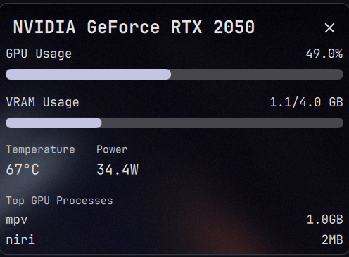

# NVIDIA GPU Monitor for DankMaterialShell

A native **NVIDIA** GPU monitoring widget for [DankMaterialShell](https://github.com/DankMaterialShell/DankMaterialShell).



## Requirements

* DankMaterialShell
* NVIDIA drivers
* `nvidia-utils` (provides `nvidia-smi`)

```bash
# Check that the tool works:
nvidia-smi
```

## Notes

* Stats come from the first NVIDIA GPU.
* Per-process VRAM may show `--` on drivers or containers that don't expose it.
* Polling an awake GPU can keep it from entering runtime suspend. Adjust `updateInterval` in `NvidiaWidget.qml` if that matters on battery.
